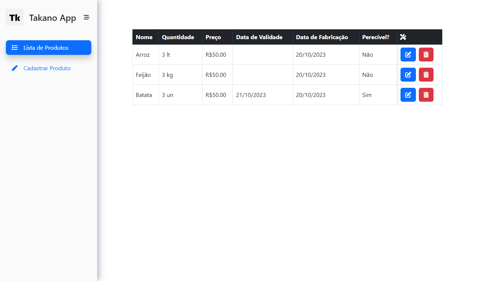

# TakanoApp

Esse projeto foi gerado com [Angular CLI](https://github.com/angular/angular-cli) versão 16.2.0.\
Trata-se de um CRUD em `localstorage` utilizando validações de formulários com <a href="https://angular.io/guide/reactive-forms" target="_blank">`Angular Reactive Forms`</a> e máscaras de inputs com `ngx-mask`

## Funcionalidades do Projeto

- [x] Listagem de Produtos
- [x] Criação de Produtos
- [x] Edição de Produtos
- [x] Remoção de Produtos

## Layout (responsivo)



## Preparação
```bash
# Clone este repositório
$ git clone linkrepo

# Acesse a pasta do projeto no seu terminal
$ cd takanoApp

# Instale as dependências
$ npm install

# Execute a aplicação
$ npm start

# A aplicação será iniciada na porta 4200, acesse pleo navegado: https://localhost:4200
```
## Autores


<a href="https://www.linkedin.com/in/t4kano/"> Linkedin</a>
